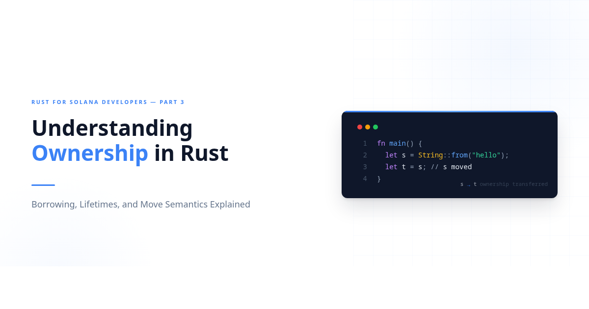
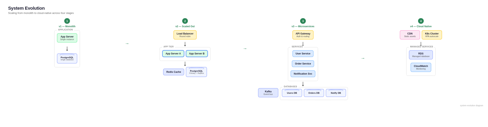
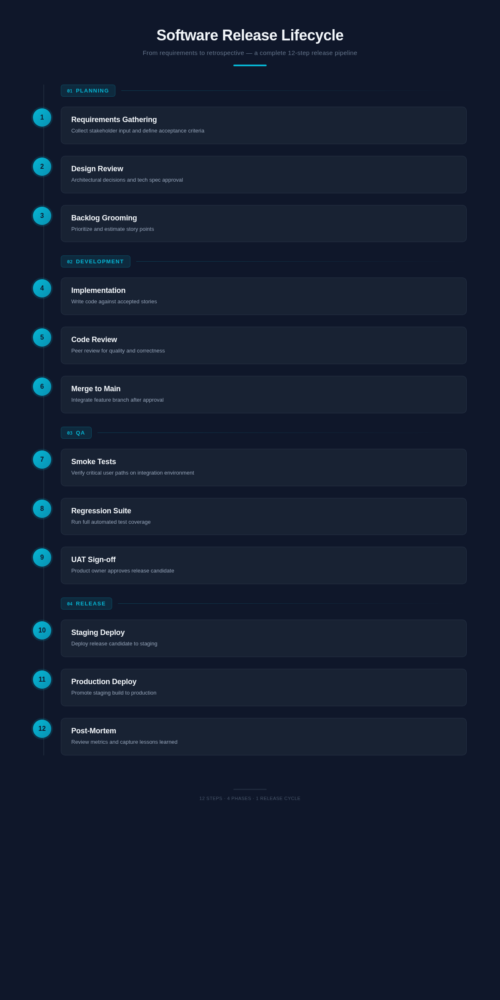
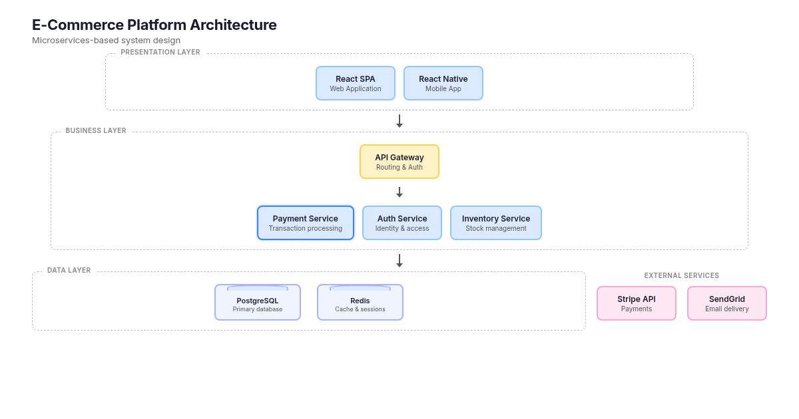
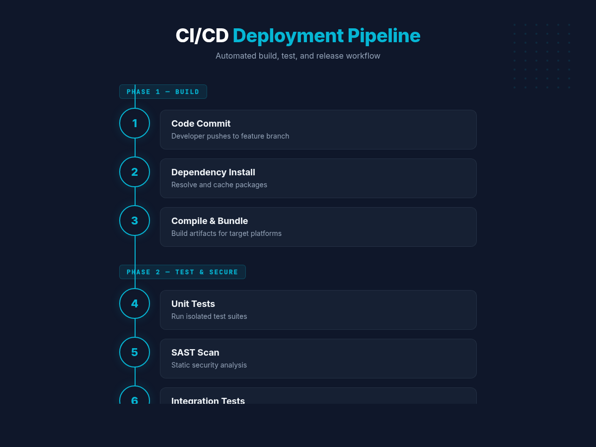

# eyay-toolkits

[](https://skills.sh/widnyana/eyay-toolkits)

Claude Code plugins for people who'd rather ship than configure.

These started as things I kept re-teaching Claude in every session -- review patterns, decimal validation traps, how to write without sounding like a press release. Eventually I packed them into skills so I could stop repeating myself. If any of them save you time, good. Steal them.

## The plugins

| Plugin | What it does | Details |
|--------|-------------|---------|
| **bmad-sprint-run** | Drives Claude Code through an entire BMad sprint autonomously — creates stories, implements them, runs quality gates, handles retries, and commits results. Two modes: skill (`/bmad-sprint-run`) and Python companion (`sprint-runner.py`). | [README](plugins/bmad-sprint-run/README.md) |
| **career-tools** | Cover letters and CVs from repo contents. Markdown or ATS-friendly LaTeX. | [README](plugins/career-tools/README.md) |
| **evm-decimal-validation** | Audits hardcoded decimals, queries on-chain values, fixes FromWei/ToWei conversions. Catches the "18 decimals everywhere" mistake before it hits production. | [README](plugins/evm-decimal-validation/README.md) |
| **solana-onchain** | Query accounts, analyze transactions, execute operations on Solana. Defaults to devnet because mainnet mistakes are permanent. | [README](plugins/solana-onchain/README.md) |
| **sui-dev-tools** | Move smart contracts, TypeScript SDK, dApp Kit, Seal secrets, Walrus storage. All the Sui things in one plugin. | [README](plugins/sui-dev-tools/README.md) |
| **prose-engineers** | Docs and articles that read like a colleague explaining something over coffee. Problem-first, concrete, no filler. Public and internal modes. | [README](plugins/prose-engineers/README.md) |
| **ts-backend-dev** | TypeScript backend skills: kill N+1 queries, review code for architecture and security issues, design Prisma schemas that won't paint you into a corner. | [README](plugins/ts-backend-dev/README.md) |
| **visual-gen** | Blog cover images, architecture diagrams, and process infographics as PNG via HTML+CSS + Chrome headless. | [README](plugins/visual-gen/README.md) |
| **block-forbidden-git-add** | PreToolUse hook that blocks `git add .`/`-A`, staging protected paths (`docs/`, `CLAUDE.md`, ...), and history rewrites (`rebase`, `reset`, `commit --amend`, `push -f`). | [README](plugins/block-forbidden-git-add/README.md) |

## Install via skills.sh

```bash
npx skills add widnyana/eyay-toolkits
```

## visual-gen samples

| Standard (1200x630) | Wide (2400x630) | Tall (1200x2400) |
|---|---|---|
|  |  |  |
|  | |  |

## Contributing

See [CONTRIBUTING.md](CONTRIBUTING.md) for the plugin structure and how to add your own.

## License

[MIT](LICENSE) -- see individual plugin directories for specifics.
