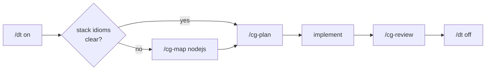

# design-thinking — a pi package

AI coding agents ship code before asking what breaks. This extension flips the
order: with `/dt` active, [pi](https://pi.dev) draws the call graph first —
nodes are functions, edges are data flow, every failure path is named — then
writes code that *is* the graph. Plans, reviews, and refactors render in a
fixed, mechanically checkable notation (Graph Protocol) that looks the same in
Go, Rust, Python, or TypeScript.

Method by [r17x](https://github.com/r17x) ([Design Thinking
gist](https://gist.github.com/r17x/90eb2f7be93932b5693753aedb09c01a),
originally Effect-TS), generalized into this stack-agnostic pi package.
Licensed MIT — see [LICENSE](LICENSE).

## Why

A prose plan doesn't survive contact with review. An agent proposes "add
rate limiting, handle errors," the plan reads fine, and the diff either
matches it or it doesn't — prose gives no way to check which. Two failure
modes follow from that: the agent picks an unstated failure path (swallow
the error, retry silently, drop the request) nobody agreed to, or the
reviewer approves a plan that was never specific enough to catch the
mismatch once the code lands.

Design Graph replaces the prose plan with something that can be diffed.
Nodes are functions, edges are data and error/escape paths, boundaries are
named — fixed before code exists. `/cg-review` then reconstructs the graph
the code actually implements and diffs it against the one that was planned,
finding by finding, ending in a VERDICT. The notation is the same shape in
Go, Rust, Python, or TypeScript, so the check doesn't depend on the stack.

Skip it for a one-line fix — prose is fine there. Reach for `/dt` when the
change has a failure path worth agreeing on before it's written.

## Install

```bash
# from npm
pi install npm:@widnyana/design-thinking

# via OMP
omp install npm:@widnyana/design-thinking

# pinned version
pi install npm:@widnyana/design-thinking@0.0.1

# from a local checkout of this repo
pi install /absolute/path/to/pi-packages/design-thinking

# via the omp marketplace
omp plugin marketplace add widnyana/eyay-toolkits
omp plugin install design-thinking@eyay-toolkits

# try without installing
pi -e npm:@widnyana/design-thinking
pi -e ./pi-packages/design-thinking
```

> The `npm:` prefix is required — a bare name is parsed by pi as a local path.

## Usage

| Command | What it does |
|---|---|
| `/dt` | Toggle Design Thinking mode. While on, plans and reviews render as Design Graphs. Persists across restarts. |
| `/dt on\|off\|status` | Set or query the mode explicitly. |
| Review dialog | When a run ends with a presented Design Graph, a dialog opens automatically (arrow keys + Enter or mouse): **Approve** arms file edits **and** sends the go-ahead so implementation starts immediately, **Refine** asks for feedback and sends it back to the agent (the dialog re-opens after the updated graph), **Deny** keeps edits blocked. Headless/no-UI sessions fall back to manual `/dt approve\|deny`. |
| `/dt <prompt>` | Turn the mode **on** (never off), then run `<prompt>` under it — graph and clarifying questions first, implementation after your go-ahead. |
| `/cg <module \| task>` | Generate a call graph: extract the graph existing code implements, or sketch one for a task. |
| `/cg-plan <task>` | Design before code — full Design Graph, then implement to match it. |
| `/cg-review [file\|module\|diff]` | Reconstruct the implemented graph, diff it against the method's checklist, end with a VERDICT. |
| `/cg-map <language\|framework>` | Map the Protocol vocabulary onto a stack's idioms (Result vs exceptions, RAII vs defer). |

## A real-world walkthrough

Task: *add rate limiting to an Express API.* One design pass, end to end:

```
> /dt                                        # mode on — graph-first rules injected

> /cg-plan add per-user rate limiting to the API
    → agent sketches a DesignGraph first (SHAPES, GRAPH, E, boundaries),
      then implements code that matches it

> /cg-map nodejs                             # optional: before planning, when the
    → maps ⟳↯☠🔒 onto express idioms         #   stack's vocabulary is unclear
      (middleware = boundary, AbortError = ↯escape)

> git diff → review it with:
> /cg-review src/middleware/ratelimit.ts
    → extracts the graph the code ACTUALLY implements, diffs it against
      the planned one, findings grouped by § number, ends with VERDICT

> /dt off                                    # done — back to normal mode
```

The cycle:



Skills (`graph-protocol`, `design-method`, `design-graph`) are loaded by the
agent on demand mid-turn — you never invoke them directly; the `/cg*` prompts
and `/dt` mode tell the model when to reach for them.
